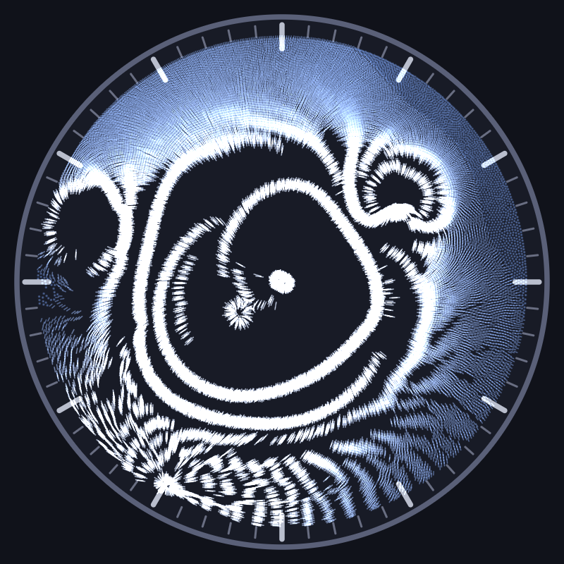

# magnetic-time

A desktop clock where the hands carry magnets and move beneath a thin layer of
liquid filled with magnetic particles. The particles are dragged along by the
field of the hands, lagging with viscous drag: slow hands carry their
particles, the second hand outruns its own and plows rings, wakes, and comet
trails that slowly relax. Every pattern on the dial is simulated, not painted.

Native Rust application rendered with egui.



More screenshots, a longer description, and a live in-browser build (wasm):
[project page](https://wistrand.github.io/magnetic-time/)
(source in [docs/](docs/), publishable via GitHub Pages; rebuild the wasm app
with `./scripts/build-web.sh`).

## Quick start

```bash
cargo run --release
```

The dev side panel exposes all tunables live (magnet layout/shape/strength per
hand, particle physics, time-speed multiplier). Headless rendering to PNG:

```bash
cargo run --release -- --headless --time 13:37:35 --sim-seconds 600 --dump out.png
```

See `cargo run -- --help` for all flags.

## Development

Agent-oriented docs live in [CLAUDE.md](CLAUDE.md) and
[agent_docs/](agent_docs/); the build plan is
[agent_docs/plan.md](agent_docs/plan.md).

## License

[MIT](LICENSE)
